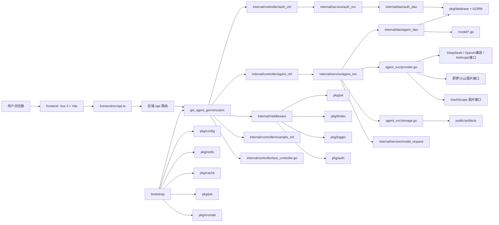
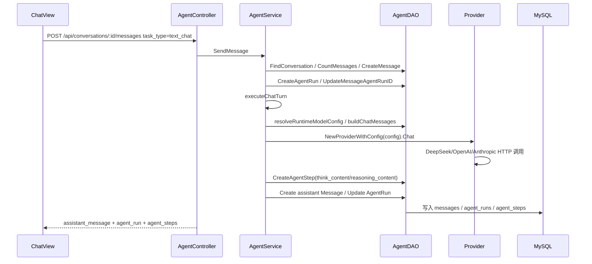
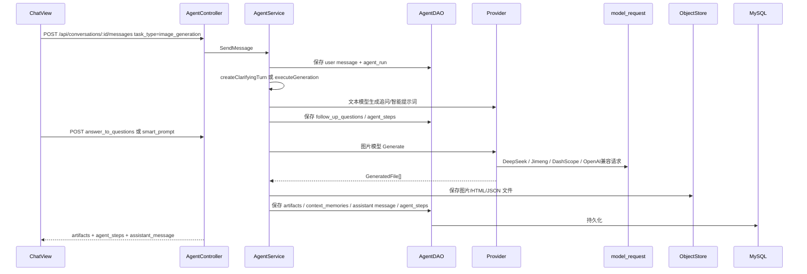
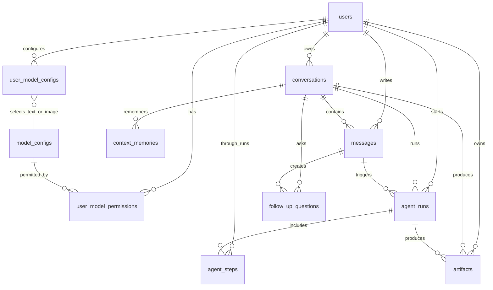

# 图片 AI Agent 项目依赖图与模块调用关系

生成时间：2026-05-25  
扫描范围：`gin_agent_gorm` 后端、`frontend/src` 前端、`go.mod`、`frontend/package.json`。  
扫描方式：静态源码扫描，包括 Go import、路由注册、Controller/Service/DAO 调用、Vue import、前端 API 调用、依赖清单。  
说明：`go list -deps` 在当前沙箱环境中因 Go build cache 写入权限受限未能完整展开标准库和间接编译依赖，因此本文以 `go.mod`、`package.json` 和源码静态调用为准。

## 1. 总体依赖图



## 2. 前端外部依赖

来源：`frontend/package.json`、`npm ls --depth=0`。

| 依赖 | 版本 | 用途 |
|---|---:|---|
| `@vitejs/plugin-vue` | `^5.0.0` / installed `5.2.4` | Vite Vue 单文件组件插件 |
| `typescript` | `^5.4.0` / installed `5.9.3` | TypeScript 类型系统 |
| `vite` | `^5.0.0` / installed `5.4.21` | 前端开发服务器和构建工具 |
| `vue` | `^3.4.0` / installed `3.5.34` | Vue 3 前端框架 |
| `vue-router` | `^5.0.7` / installed `5.0.7` | 前端路由 |
| `vue-tsc` | `^2.0.0` / installed `2.2.12` | Vue + TypeScript 类型检查 |

## 3. 后端外部依赖

来源：`gin_agent_gorm/go.mod`。以下为 `require` 中全部依赖。

| 依赖 | 版本 | 标记 | 用途 |
|---|---:|---|---|
| `github.com/disintegration/imaging` | `v1.6.2` | direct | 图片处理 |
| `github.com/fsnotify/fsnotify` | `v1.5.1` | direct | 文件监听，配置热加载相关 |
| `github.com/gertd/go-pluralize` | `v0.2.0` | direct | 单复数转换工具 |
| `github.com/gin-gonic/gin` | `v1.7.7` | direct | HTTP Web 框架 |
| `github.com/go-redis/redis/v8` | `v8.11.5` | direct | Redis 客户端 |
| `github.com/golang-jwt/jwt` | `v3.2.2+incompatible` | direct | JWT 签发和解析 |
| `github.com/google/uuid` | `v1.3.0` | indirect | UUID 支持 |
| `github.com/hibiken/asynq` | `v0.23.0` | direct | Redis 异步任务队列 |
| `github.com/iancoleman/strcase` | `v0.2.0` | direct | 字符串命名风格转换 |
| `github.com/juju/ratelimit` | `v1.0.1` | direct | Token Bucket 限流 |
| `github.com/mojocn/base64Captcha` | `v1.3.5` | direct | 图形验证码 |
| `github.com/pkg/errors` | `v0.9.1` | direct | 错误包装 |
| `github.com/robfig/cron/v3` | `v3.0.1` | direct | 定时任务 |
| `github.com/rogpeppe/go-internal` | `v1.8.0` | indirect | Go 内部工具依赖 |
| `github.com/shirou/gopsutil` | `v3.21.11+incompatible` | direct | 系统信息 |
| `github.com/spf13/cast` | `v1.5.0` | direct | 类型转换 |
| `github.com/spf13/cobra` | `v1.4.0` | direct | CLI 命令框架 |
| `github.com/spf13/viper` | `v1.10.1` | direct | 配置读取 |
| `github.com/thedevsaddam/govalidator` | `v1.9.10` | direct | 请求参数校验 |
| `github.com/tklauser/go-sysconf` | `v0.3.10` | indirect | 系统配置依赖 |
| `github.com/ulule/limiter/v3` | `v3.10.0` | direct | Redis/HTTP 限流 |
| `github.com/yusufpapurcu/wmi` | `v1.2.2` | indirect | Windows WMI 支持 |
| `go.uber.org/atomic` | `v1.9.0` | indirect | 原子操作工具 |
| `go.uber.org/multierr` | `v1.8.0` | indirect | 多错误合并 |
| `go.uber.org/zap` | `v1.21.0` | direct | 结构化日志 |
| `golang.org/x/crypto` | `v0.0.0-20220214200702-86341886e292` | direct | 加密工具 |
| `golang.org/x/image` | `v0.0.0-20220302094943-723b81ca9867` | indirect | 图片处理依赖 |
| `golang.org/x/sys` | `v0.0.0-20220712014510-0a85c31ab51e` | indirect | 系统调用 |
| `golang.org/x/time` | `v0.0.0-20220609170525-579cf78fd858` | indirect | 时间/限流相关工具 |
| `google.golang.org/protobuf` | `v1.28.0` | indirect | Protobuf 支持 |
| `gopkg.in/alexcesaro/quotedprintable.v3` | `v3.0.0-20150716171945-2caba252f4dc` | indirect | 邮件编码相关 |
| `gopkg.in/check.v1` | `v1.0.0-20201130134442-10cb98267c6c` | indirect | 测试依赖 |
| `gopkg.in/gomail.v2` | `v2.0.0-20160411212932-81ebce5c23df` | direct | SMTP 邮件发送 |
| `gopkg.in/natefinch/lumberjack.v2` | `v2.0.0` | direct | 日志滚动切割 |
| `gorm.io/driver/mysql` | `v1.3.2` | direct | GORM MySQL 驱动 |
| `gorm.io/gorm` | `v1.23.2` | direct | ORM |

## 4. 前端内部模块依赖

| 模块 | 依赖 | 调用/用途 |
|---|---|---|
| `frontend/src/main.ts` | `vue`、`App.vue`、`styles.css`、`router` | 创建 Vue 应用并挂载路由 |
| `frontend/src/router/index.ts` | `vue-router`、`../api` | 定义 `/login`、`/register`、`/chat`、`/settings`，通过 `getToken()` 做登录拦截 |
| `frontend/src/api.ts` | `./types`、浏览器 `fetch/localStorage` | 封装 `apiFetch`、token、当前用户、下载产物、提示词优化 |
| `frontend/src/App.vue` | `router-view` | 页面容器 |
| `frontend/src/styles.css` | 无 TS 依赖 | 全局 UI 样式 |
| `frontend/src/types.ts` | 无运行时依赖 | 定义 API 响应、会话、消息、AgentStep、Artifact、模型配置、用户信息等类型 |
| `frontend/src/views/LoginView.vue` | `vue`、`vue-router`、`../api`、`../types` | 登录页，调用登录接口并保存 token/user |
| `frontend/src/views/RegisterView.vue` | `vue`、`vue-router`、`../api`、`../types` | 注册页，调用验证码、注册、获取当前用户接口 |
| `frontend/src/views/SettingsView.vue` | `vue`、`vue-router`、`../api`、`../types` | 设置页，加载用户可用模型并保存模型选择 |
| `frontend/src/views/ChatView.vue` | `vue`、`vue-router`、`../api`、`../types` | 对话工作台，管理会话、消息、模型选择、提示词优化、Agent 步骤、产物预览与下载 |

## 5. 前端 API 调用清单

| 前端模块 | API | 方法 | 用途 |
|---|---|---|---|
| `LoginView.vue` | `/api/auth/login` | `POST` | 用户登录 |
| `RegisterView.vue` | `/api/auth/register/email-verify-code` | `POST` | 发送邮箱验证码 |
| `RegisterView.vue` | `/api/auth/register/using-email` | `POST` | 邮箱注册 |
| `RegisterView.vue` | `/api/auth/me` | `GET` | 注册后获取当前用户 |
| `SettingsView.vue` | `/api/auth/me` | `GET` | 设置页加载当前用户 |
| `SettingsView.vue` | `/api/settings/model-selection` | `GET` | 获取用户可用文本/图片模型和当前选择 |
| `ChatView.vue` | `/api/settings/model-selection` | `GET` | 对话页加载模型选择 |
| `ChatView.vue` | `/api/auth/me` | `GET` | 对话页加载当前用户 |
| `ChatView.vue` | `/api/conversations` | `GET` | 获取会话列表 |
| `ChatView.vue` | `/api/conversations` | `POST` | 创建会话 |
| `ChatView.vue` | `/api/conversations/:id/messages` | `GET` | 获取会话消息和关联 Agent Run |
| `ChatView.vue` | `/api/conversations/:id/messages` | `POST` | 发送普通输入、智能问答回答、智能提示词 |
| `ChatView.vue` | `/api/conversations/:id/artifacts` | `GET` | 获取会话产物 |
| `ChatView.vue` | `/api/prompts/optimize` | `POST` | 智能优化提示词 |
| `ChatView.vue` | `/api/runs/:id/steps` | `GET` | 获取持久化 Agent 步骤和思考内容 |
| `api.ts/downloadArtifact` | `/api/artifacts/:id/download` | `GET` | 下载产物文件 |
| `api.ts/optimizePrompt` | `/api/prompts/optimize` | `POST` | 通用提示词优化封装 |

## 6. 后端内部模块依赖

### 6.1 启动与基础设施

| 模块 | 依赖 | 调用/用途 |
|---|---|---|
| `main.go` | `cmd`、`global`、`config`、`bootstrap`、`console`、`logger` | 初始化根路径、执行 CLI/服务启动 |
| `cmd/root.go` | `cobra`、`global`、`console` | 根命令定义 |
| `cmd/gin_server.go` | `bootstrap` | 启动 Gin 服务 |
| `cmd/cache.go` | `pkg/cache`、`pkg/redis` | 缓存命令 |
| `cmd/generate.go` | `console`、`helper` | 代码生成命令 |
| `cmd/make.go` | `helper/strx`、`file`、`console` | 脚手架生成命令 |
| `bootstrap/boot.go` | `global`、`logger` | 总启动流程 |
| `bootstrap/config.go` | `pkg/config`、`global` | 读取配置 |
| `bootstrap/logger.go` | `pkg/logger` | 初始化 Zap 日志 |
| `bootstrap/database.go` | `pkg/database`、`pkg/logger`、`gorm mysql` | 初始化 MySQL/GORM |
| `bootstrap/redis.go` | `pkg/redis` | 初始化 Redis |
| `bootstrap/cache.go` | `pkg/cache`、`pkg/redis` | 初始化缓存驱动 |
| `bootstrap/queue_job.go` | `pkg/job`、`config`、`redis`、`asynq` | 初始化异步任务队列 |
| `bootstrap/crontab.go` | `pkg/crontab`、`global`、`crontab` | 初始化定时任务 |
| `bootstrap/router.go` | `gin`、`routers`、`middleware`、`config` | 初始化 Gin Engine、中间件、API 路由 |
| `bootstrap/server.go` | `http`、`config`、`global` | 启动 HTTP Server |
| `bootstrap/ai_agent.go` | `model`、`pkg/database`、`logger` | AI Agent 相关表结构迁移 |

### 6.2 路由层

| 模块 | 依赖 | 注册内容 |
|---|---|---|
| `routers/api.go` | `gin`、`middleware`、`config`、`global` | `/api` 根路由、全局 IP 限流、静态文件 `/uploads` 和 `/artifacts` |
| `routers/auth_routes.go` | `auth_ctrl`、`middleware` | `/api/auth/*` 登录、注册、用户信息 |
| `routers/agent_routes.go` | `agent_ctrl`、`middleware` | AI Agent 会话、消息、产物、步骤、模型配置、模型权限 |
| `routers/example_routes.go` | `example_ctrl` | 示例验证码、邮件、分页、上传、异步任务 |
| `routers/test_routes.go` | `test_controller`、`middleware` | 测试路由 |

### 6.3 Controller 层

| 模块 | 依赖 | 调用目标 |
|---|---|---|
| `internal/controller/auth_ctrl/register_controller.go` | `auth_request`、`auth_svc`、`responses`、`errcode`、`validator`、`verifycode` | 邮箱验证码发送、邮箱注册、生成 token |
| `internal/controller/auth_ctrl/user_controller.go` | `auth_svc`、`auth`、`responses`、`paginator` | 登录、当前用户、用户列表 |
| `internal/controller/agent_ctrl/agent_controller.go` | `agent_request`、`agent_svc`、`auth`、`responses`、`errcode` | 会话、消息、提示词优化、产物、Agent Run 步骤、用户模型配置、模型选择 |
| `internal/controller/agent_ctrl/model_config_controller.go` | `agent_svc`、`auth`、`responses`、`errcode` | 全局模型配置 CRUD、文本模型列表、图片模型列表 |
| `internal/controller/agent_ctrl/model_permission_controller.go` | `agent_svc`、`auth`、`responses`、`errcode` | 模型权限查询、设置、批量设置、权限检查 |
| `internal/controller/example_ctrl/captcha_controller.go` | `captcha`、`responses`、`errcode` | 示例验证码 |
| `internal/controller/example_ctrl/email_controller.go` | `email`、`responses`、`errcode` | 示例邮件发送 |
| `internal/controller/example_ctrl/pager_controller.go` | `auth_svc`、`paginator`、`responses` | 示例分页 |
| `internal/controller/example_ctrl/upload_controller.go` | `upload`、`responses`、`errcode` | 示例上传 |
| `internal/controller/example_ctrl/async_queue_job_controller.go` | `job`、`pkg/job`、`responses`、`errcode` | 示例异步任务 |
| `internal/controller/test_controller.go` | `responses` | 测试接口 |

### 6.4 Service 层

| 模块 | 依赖 | 调用/职责 |
|---|---|---|
| `internal/service/auth_svc/register_service.go` | `auth_request`、`model`、`jwt`、`database`、`hash` | 注册用户、生成 JWT |
| `internal/service/auth_svc/user_service.go` | `auth_dao`、`model` | 用户列表 |
| `internal/service/agent_svc/agent_service.go` | `agent_dao`、`model`、`ObjectStore` | AgentService 构造与基础依赖 |
| `internal/service/agent_svc/conversation_service.go` | `agent_dao`、`model`、`strings` | 会话列表、创建、标题生成 |
| `internal/service/agent_svc/message_service.go` | `agent_dao`、`agent_request`、`model`、`gorm/errors` | 消息入口、Agent Run 创建、任务类型分流、消息关联 |
| `internal/service/agent_svc/agent_workflow_service.go` | `agent_dao`、`model_request`、`Provider`、`ObjectStore`、`logger` | 文本对话、追问、智能问答、提示词优化、图片生成、Agent Step 持久化、产物保存 |
| `internal/service/agent_svc/model_config_service.go` | `agent_dao`、`model`、`agent_request`、`database` | 用户模型配置、模型选择、全局模型 CRUD |
| `internal/service/agent_svc/model_permission_service.go` | `user_model_permission_dao`、`agent_dao`、`model` | 用户模型权限 |
| `internal/service/agent_svc/provider.go` | `model_request`、`model`、`http`、`logger` | 文本/图片模型 Provider，DeepSeek/OpenAI/Anthropic/DashScope/即梦适配 |
| `internal/service/agent_svc/storage.go` | `config`、`global`、`file/hash` | 本地对象存储，保存 artifact 文件 |
| `internal/service/agent_svc/service_utils.go` | `path/filepath`、`strings` | 安全下载文件名等工具 |
| `internal/service/model_request/deepseek.go` | `http`、`json`、`errors` | DeepSeek Chat 请求封装 |
| `internal/service/model_request/jimeng.go` | `http`、`json`、`crypto/hmac`、`sha256`、`logger` | 即梦/火山图片任务提交、签名、轮询 |

### 6.5 DAO 层

| 模块 | 依赖 | 数据访问内容 |
|---|---|---|
| `internal/dao/auth_dao/user_dao.go` | `model`、`database` | 用户列表查询 |
| `internal/dao/agent_dao/agent_dao.go` | `model`、`database` | 会话、消息、问题、AgentRun、AgentStep、ContextMemory、Artifact、模型配置、模型选择 |
| `internal/dao/agent_dao/user_model_permission_dao.go` | `model`、`database` | 用户模型权限 CRUD |

### 6.6 Middleware 层

| 模块 | 依赖 | 职责 |
|---|---|---|
| `accept_header_middleware.go` | `gin` | Accept 头处理 |
| `access_log_middleware.go` | `gin`、`logger` | 请求/响应日志 |
| `auth_jwt_middleware.go` | `jwt`、`auth`、`database`、`model`、`responses` | JWT 鉴权和当前用户注入 |
| `guest_jwt_middleware.go` | `jwt` | 游客 JWT |
| `cors_middleware.go` | `gin`、`config` | CORS |
| `context_timeout_middleware.go` | `context`、`gin` | 请求超时 |
| `force_ua_middleware.go` | `gin`、`errcode`、`responses` | User-Agent 检查 |
| `rate_limiter_middleware.go` | `limiter`、`redis`、`responses` | Redis 限流 |
| `token_bucket_limiter_middleware.go` | `limiter`、`responses` | Token Bucket 限流 |
| `recovery_middleware.go` | `gin`、`logger`、`responses` | Panic 恢复 |

### 6.7 Model 层

| 模型文件 | 表/结构 | 被依赖模块 |
|---|---|---|
| `model/user_model.go` | `users` | 注册、登录、鉴权、用户信息 |
| `model/user_model_permission_model.go` | 用户权限结构 | 模型权限相关 |
| `model/conversation_model.go` | `conversations` | 会话列表、消息、Agent Run |
| `model/message_model.go` | `messages` | 对话消息、显示模型名、优化提示词 |
| `model/follow_up_question_model.go` | `follow_up_questions` | 智能追问 |
| `model/agent_run_model.go` | `agent_runs` | 一次 Agent 执行任务 |
| `model/agent_step_model.go` | `agent_steps` | Agent 步骤、业务思考、模型推理内容 |
| `model/context_memory_model.go` | `context_memories` | 上下文记忆 |
| `model/artifact_model.go` | `artifacts` | 图片/HTML/JSON 等产物元数据 |
| `model/user_model_config_model.go` | `user_model_configs` | 用户模型配置与模型选择 |
| `model/model_config_model.go` | `model_configs` | 全局文本/图片模型配置 |
| `model/json_map.go` | JSON Map 类型 | 模型配置扩展信息 |
| `model/base_model.go` | 公共 ID 字段 | 多数模型嵌入 |
| `model/ai_agent_timestamp.go` | 公共时间戳 | AI Agent 模型嵌入 |

### 6.8 pkg 工具模块

| 模块 | 依赖 | 职责 |
|---|---|---|
| `pkg/app` | `gin`、`json` | 请求体读取与解析辅助 |
| `pkg/auth` | `gin`、`database`、`model` | 当前用户 ID/用户信息 |
| `pkg/cache` | `redis`、`time` | 缓存服务与 Redis 驱动 |
| `pkg/captcha` | `base64Captcha`、`redis` | 图形验证码 |
| `pkg/config` | `viper`、`fsnotify`、`cast` | 配置加载 |
| `pkg/console` | 标准输出 | 控制台颜色输出 |
| `pkg/crontab` | `robfig/cron` | 定时任务封装 |
| `pkg/database` | `gorm`、`gorm/mysql`、`logger` | MySQL/GORM 连接 |
| `pkg/email` | `gomail`、`config` | 邮件发送 |
| `pkg/errcode` | 标准库 | 统一错误码 |
| `pkg/file` | `uuid`、`path/filepath` | 文件名生成 |
| `pkg/hash` | `bcrypt` | 密码哈希 |
| `pkg/helper` | 标准库和子包 | 通用工具 |
| `pkg/helper/arrayx` | 标准库 | 数组工具 |
| `pkg/helper/mapx` | 标准库 | Map/Set 工具 |
| `pkg/helper/structx` | `json` | 结构体转换 |
| `pkg/helper/strx` | `pluralize`、`strcase`、`rand` | 字符串工具 |
| `pkg/job` | `asynq` | 异步任务客户端/服务端 |
| `pkg/jwt` | `golang-jwt/jwt`、`config` | JWT 生成、刷新、解析 |
| `pkg/limiter` | `ulule/limiter`、`redis`、`ratelimit` | 限流 |
| `pkg/logger` | `zap`、`lumberjack`、`gorm logger` | 应用日志和 GORM 日志 |
| `pkg/paginator` | `gin`、`gorm`、`config` | 分页 |
| `pkg/redis` | `go-redis/redis/v8`、`config` | Redis 客户端集合 |
| `pkg/responses` | `gin`、`errcode`、`paginator` | 统一响应 |
| `pkg/upload` | `imaging`、`file`、`config` | 文件上传与图片处理 |
| `pkg/validator` | `govalidator`、`database`、`captcha`、`verifycode` | 参数校验 |
| `pkg/verifycode` | `redis`、`email`、`strx`、`config` | 邮箱验证码 |

## 7. 后端 API 路由到模块调用关系

### 7.1 认证路由

| 路由 | Controller | Service/DAO/工具 |
|---|---|---|
| `POST /api/auth/register/email-verify-code` | `RegisterController.SendEmailVerifyCode` | `verifycode.NewVerifyCode().SendEmailVerifyCode` -> `email.NewMailer` -> SMTP |
| `POST /api/auth/register/using-email` | `RegisterController.SignupUsingEmail` | `validator` -> `RegisterService.CreateUserToken` -> `database.DB.Create(User)` -> `jwt.GenerateToken` |
| `POST /api/auth/login` | `UserController.Login` | `database.DB` 查用户 -> `hash.CheckHash` -> `jwt.GenerateToken` |
| `GET /api/auth/user` | `UserController.Index` | `UserService.GetUsers` -> `UserDao.GetUsers` -> `database.DB` |
| `GET /api/auth/me` | `UserController.Profile` | `middleware.AuthJWT` -> `auth.CurrentUser` |

### 7.2 Agent 会话与消息路由

| 路由 | Controller | Service/DAO/Provider |
|---|---|---|
| `GET /api/conversations` | `AgentController.ListConversations` | `AgentService.ListConversations` -> `AgentDAO.ListConversations` |
| `POST /api/conversations` | `AgentController.CreateConversation` | `AgentService.CreateConversation` -> `AgentDAO.CreateConversation` |
| `GET /api/conversations/:id/messages` | `AgentController.ListMessages` | `AgentService.ListMessages` + `ListMessageRuns` -> `AgentDAO.ListMessages` + `ListAgentRunsByIDs` |
| `POST /api/conversations/:id/messages` | `AgentController.SendMessage` | `AgentService.SendMessage` -> 文本聊天/图片生成/智能追问/智能提示词分流 |
| `POST /api/prompts/optimize` | `AgentController.OptimizePrompt` | `AgentService.OptimizePrompt` -> `model_request.OptimizePromptWithDeepseek` |
| `GET /api/conversations/:id/artifacts` | `AgentController.ListArtifacts` | `AgentService.ListArtifacts` -> `AgentDAO.ListArtifacts` |
| `GET /api/artifacts/:id/download` | `AgentController.DownloadArtifact` | `AgentService.FindArtifact` -> `AgentDAO.FindArtifact` -> `ObjectStore.Path` |
| `GET /api/runs/:id/events` | `AgentController.RunEvents` | `AgentService.ListRunEvents` -> `AgentDAO.ListAgentSteps` -> SSE 输出 |
| `GET /api/runs/:id/steps` | `AgentController.ListRunSteps` | `AgentService.ListRunEvents` -> `AgentDAO.ListAgentSteps` |

### 7.3 模型配置与权限路由

| 路由 | Controller | Service/DAO |
|---|---|---|
| `GET /api/settings/model-config` | `AgentController.GetModelConfig` | `AgentService.GetModelConfig` -> `AgentDAO.FindUserModelConfig` |
| `PUT /api/settings/model-config` | `AgentController.SaveModelConfig` | `AgentService.SaveModelConfig` -> `AgentDAO.SaveUserModelConfig` |
| `GET /api/settings/model-selection` | `AgentController.GetModelSelection` | `AgentService.GetModelSelection` -> 用户可用文本/图片模型 |
| `PUT /api/settings/model-selection` | `AgentController.SaveModelSelection` | `AgentService.SaveModelSelection` -> `AgentDAO.SaveUserModelSelection` |
| `GET /api/model-configs` | `ModelConfigController.ListModelConfigs` | `AgentService.ListModelConfigs` |
| `GET /api/model-configs/text-models` | `ModelConfigController.ListTextModels` | `AgentService.ListTextModels` |
| `GET /api/model-configs/image-models` | `ModelConfigController.ListImageModels` | `AgentService.ListImageModels` |
| `GET /api/model-configs/:id` | `ModelConfigController.GetModelConfig` | `AgentService.GetModelConfigByID` |
| `POST /api/model-configs` | `ModelConfigController.CreateModelConfig` | `AgentService.CreateModelConfig` |
| `PUT /api/model-configs/:id` | `ModelConfigController.UpdateModelConfig` | `AgentService.UpdateModelConfig` |
| `DELETE /api/model-configs/:id` | `ModelConfigController.DeleteModelConfig` | `AgentService.DeleteModelConfig` |
| `GET /api/permissions/model-permissions` | `ModelPermissionController.GetUserModelPermissions` | `ModelPermissionService.GetUserModelPermissions` |
| `GET /api/permissions/available-models` | `ModelPermissionController.GetUserAvailableModels` | `ModelPermissionService.GetUserAvailableModels` |
| `GET /api/permissions/check/model/:model_id` | `ModelPermissionController.CheckModelPermission` | `ModelPermissionService.CheckUserModelPermission` |
| `POST /api/permissions/user-model-permission` | `ModelPermissionController.SetUserModelPermission` | `ModelPermissionService.SetUserModelPermission` |
| `POST /api/permissions/user-model-permissions` | `ModelPermissionController.BatchSetUserModelPermissions` | `ModelPermissionService.BatchSetUserModelPermissions` |

### 7.4 示例与测试路由

| 路由 | Controller | 调用 |
|---|---|---|
| `/api/example/*` | `example_ctrl/*` | 验证码、邮件、分页、上传、异步队列示例 |
| `/api/test/*` | `TestController` | 测试接口 |

## 8. Agent 核心运行调用链

### 8.1 文本对话



### 8.2 图片生成与智能追问



## 9. 数据依赖关系



## 10. 文件级模块清单

### 10.1 前端文件

```text
frontend/src/App.vue
frontend/src/main.ts
frontend/src/router/index.ts
frontend/src/api.ts
frontend/src/types.ts
frontend/src/styles.css
frontend/src/views/LoginView.vue
frontend/src/views/RegisterView.vue
frontend/src/views/ChatView.vue
frontend/src/views/SettingsView.vue
```

### 10.2 后端业务文件

```text
gin_agent_gorm/main.go
gin_agent_gorm/cmd/cache.go
gin_agent_gorm/cmd/generate.go
gin_agent_gorm/cmd/gin_server.go
gin_agent_gorm/cmd/make.go
gin_agent_gorm/cmd/root.go
gin_agent_gorm/bootstrap/ai_agent.go
gin_agent_gorm/bootstrap/boot.go
gin_agent_gorm/bootstrap/cache.go
gin_agent_gorm/bootstrap/config.go
gin_agent_gorm/bootstrap/crontab.go
gin_agent_gorm/bootstrap/database.go
gin_agent_gorm/bootstrap/logger.go
gin_agent_gorm/bootstrap/queue_job.go
gin_agent_gorm/bootstrap/redis.go
gin_agent_gorm/bootstrap/router.go
gin_agent_gorm/bootstrap/server.go
gin_agent_gorm/routers/api.go
gin_agent_gorm/routers/auth_routes.go
gin_agent_gorm/routers/agent_routes.go
gin_agent_gorm/routers/example_routes.go
gin_agent_gorm/routers/test_routes.go
gin_agent_gorm/internal/controller/auth_ctrl/register_controller.go
gin_agent_gorm/internal/controller/auth_ctrl/user_controller.go
gin_agent_gorm/internal/controller/agent_ctrl/agent_controller.go
gin_agent_gorm/internal/controller/agent_ctrl/model_config_controller.go
gin_agent_gorm/internal/controller/agent_ctrl/model_permission_controller.go
gin_agent_gorm/internal/controller/example_ctrl/async_queue_job_controller.go
gin_agent_gorm/internal/controller/example_ctrl/captcha_controller.go
gin_agent_gorm/internal/controller/example_ctrl/email_controller.go
gin_agent_gorm/internal/controller/example_ctrl/pager_controller.go
gin_agent_gorm/internal/controller/example_ctrl/upload_controller.go
gin_agent_gorm/internal/controller/test_controller.go
gin_agent_gorm/internal/service/auth_svc/register_service.go
gin_agent_gorm/internal/service/auth_svc/user_service.go
gin_agent_gorm/internal/service/agent_svc/agent_service.go
gin_agent_gorm/internal/service/agent_svc/conversation_service.go
gin_agent_gorm/internal/service/agent_svc/message_service.go
gin_agent_gorm/internal/service/agent_svc/agent_workflow_service.go
gin_agent_gorm/internal/service/agent_svc/model_config_service.go
gin_agent_gorm/internal/service/agent_svc/model_permission_service.go
gin_agent_gorm/internal/service/agent_svc/provider.go
gin_agent_gorm/internal/service/agent_svc/service_utils.go
gin_agent_gorm/internal/service/agent_svc/storage.go
gin_agent_gorm/internal/service/model_request/deepseek.go
gin_agent_gorm/internal/service/model_request/jimeng.go
gin_agent_gorm/internal/dao/auth_dao/user_dao.go
gin_agent_gorm/internal/dao/agent_dao/agent_dao.go
gin_agent_gorm/internal/dao/agent_dao/user_model_permission_dao.go
gin_agent_gorm/internal/requests/auth_request/register_request.go
gin_agent_gorm/internal/requests/agent_request/conversation_request.go
gin_agent_gorm/internal/requests/agent_request/model_config_request.go
gin_agent_gorm/internal/requests/example_request/captcha_request.go
```

### 10.3 后端模型文件

```text
gin_agent_gorm/model/base_model.go
gin_agent_gorm/model/ai_agent_timestamp.go
gin_agent_gorm/model/user_model.go
gin_agent_gorm/model/user_model_permission_model.go
gin_agent_gorm/model/conversation_model.go
gin_agent_gorm/model/message_model.go
gin_agent_gorm/model/follow_up_question_model.go
gin_agent_gorm/model/agent_run_model.go
gin_agent_gorm/model/agent_step_model.go
gin_agent_gorm/model/context_memory_model.go
gin_agent_gorm/model/artifact_model.go
gin_agent_gorm/model/user_model_config_model.go
gin_agent_gorm/model/model_config_model.go
gin_agent_gorm/model/json_map.go
```

### 10.4 后端 pkg 文件

```text
gin_agent_gorm/pkg/app/app.go
gin_agent_gorm/pkg/app/request.go
gin_agent_gorm/pkg/auth/auth.go
gin_agent_gorm/pkg/cache/cache.go
gin_agent_gorm/pkg/cache/redis_driver.go
gin_agent_gorm/pkg/cache/store_interface.go
gin_agent_gorm/pkg/captcha/captcha.go
gin_agent_gorm/pkg/captcha/redis_driver.go
gin_agent_gorm/pkg/config/config.go
gin_agent_gorm/pkg/console/color.go
gin_agent_gorm/pkg/console/console.go
gin_agent_gorm/pkg/crontab/crontab.go
gin_agent_gorm/pkg/database/database.go
gin_agent_gorm/pkg/email/driver_interface.go
gin_agent_gorm/pkg/email/email.go
gin_agent_gorm/pkg/email/smtp_driver.go
gin_agent_gorm/pkg/errcode/common_code.go
gin_agent_gorm/pkg/errcode/errcode.go
gin_agent_gorm/pkg/errcode/module_code.go
gin_agent_gorm/pkg/file/file.go
gin_agent_gorm/pkg/hash/hash.go
gin_agent_gorm/pkg/helper/helper.go
gin_agent_gorm/pkg/helper/md5.go
gin_agent_gorm/pkg/helper/arrayx/array_chunk.go
gin_agent_gorm/pkg/helper/arrayx/array_convert.go
gin_agent_gorm/pkg/helper/arrayx/array_element.go
gin_agent_gorm/pkg/helper/arrayx/array_unique.go
gin_agent_gorm/pkg/helper/arrayx/in_array.go
gin_agent_gorm/pkg/helper/mapx/map_set.go
gin_agent_gorm/pkg/helper/mapx/map_sort.go
gin_agent_gorm/pkg/helper/structx/struct_convert.go
gin_agent_gorm/pkg/helper/strx/str_coalesce.go
gin_agent_gorm/pkg/helper/strx/str_convert.go
gin_agent_gorm/pkg/helper/strx/str_random.go
gin_agent_gorm/pkg/helper/strx/str_time.go
gin_agent_gorm/pkg/job/client.go
gin_agent_gorm/pkg/job/server.go
gin_agent_gorm/pkg/jwt/jwt.go
gin_agent_gorm/pkg/limiter/rate_limiter.go
gin_agent_gorm/pkg/limiter/token_bucket_interface.go
gin_agent_gorm/pkg/limiter/token_bucket_method_limiter.go
gin_agent_gorm/pkg/logger/clear.go
gin_agent_gorm/pkg/logger/gorm_logger.go
gin_agent_gorm/pkg/logger/logger.go
gin_agent_gorm/pkg/paginator/paginator.go
gin_agent_gorm/pkg/redis/redis.go
gin_agent_gorm/pkg/responses/response.go
gin_agent_gorm/pkg/upload/upload.go
gin_agent_gorm/pkg/validator/rules_cn_length.go
gin_agent_gorm/pkg/validator/rules_exists.go
gin_agent_gorm/pkg/validator/rules_required_all_db.go
gin_agent_gorm/pkg/validator/validate.go
gin_agent_gorm/pkg/validator/validators_custom.go
gin_agent_gorm/pkg/verifycode/driver_interface.go
gin_agent_gorm/pkg/verifycode/redis_driver.go
gin_agent_gorm/pkg/verifycode/verify_code.go
```

## 11. 静态扫描结论

1. 前端依赖集中在 `api.ts`，所有后端请求通过 `apiFetch` 或 `downloadArtifact` 发出。
2. 后端采用典型分层：`routers -> controller -> service -> dao -> model/database`。
3. AI Agent 业务主依赖集中在 `agent_svc`：
   - `message_service.go` 负责消息入口和任务分流。
   - `agent_workflow_service.go` 负责对话、追问、提示词优化、图片生成和步骤持久化。
   - `provider.go` 负责模型 Provider 适配。
   - `storage.go` 负责产物落盘。
4. 思考内容依赖链为：
   `Provider.Chat/Generate -> AgentService.createStepWithThinking -> AgentDAO.CreateAgentStep -> agent_steps.think_content/reasoning_content -> GET /api/runs/:id/steps -> ChatView 恢复展示`。
5. 产物依赖链为：
   `Provider.Generate -> ObjectStore.Save -> AgentDAO.CreateArtifact -> public/artifacts -> 前端右侧工作区预览/下载`。
6. 模型配置依赖链为：
   `SettingsView/ChatView -> /api/settings/model-selection -> AgentService -> model_configs + user_model_configs + user_model_permissions`。
