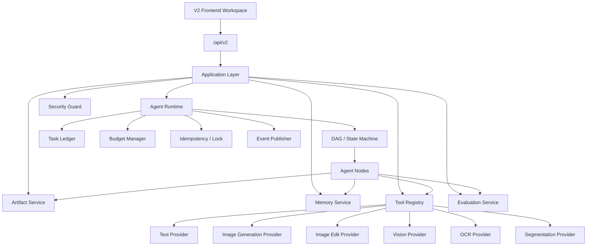

# 图片 AI Agent：当前基础到 V2 架构开发文档

生成日期：2026-05-25  
适用前提：第一版架构未完整落地，不从 V1 升级，而是基于当前项目基础直接重写到 V2  
参考文档：
- [IMAGE_AGENT_DEVELOPMENT_GUIDE.md](./IMAGE_AGENT_DEVELOPMENT_GUIDE.md)
- [IMAGE_AGENT_V2_DEVELOPMENT_PLAN.md](./IMAGE_AGENT_V2_DEVELOPMENT_PLAN.md)

## 1. 结论

当前项目不应再按“先补齐 V1，再升级 V2”的路线开发。正确路线是：

```text
保留当前可复用基础设施
  -> 冻结旧 agent_svc 图片流程
  -> 直接建设 agent_v2 核心架构
  -> 通过 /api/v2 提供新能力
  -> 前端新建 V2 工作台
  -> V2 闭环稳定后再清理旧代码
```

核心判断：

- V1 架构没有完整开发，不再投入时间补 V1。
- 当前已有 Gin、GORM、Auth、模型配置、对象存储、会话、消息、基础 artifact 等可复用能力。
- 当前已有少量 `agent_v2` 骨架，可继续作为 V2 起点。
- V2 不应迁就旧固定流程；应按 Runtime、Workflow、Memory、Artifact、Tool、Eval、Security、Frontend Workspace 拆分。

## 2. 当前基础盘点

### 2.1 可保留能力

| 能力 | 当前位置 | 处理方式 |
| --- | --- | --- |
| Gin HTTP 服务 | `gin_agent_gorm/routers`、`bootstrap` | 保留 |
| JWT 用户认证 | `internal/middleware`、`pkg/auth` | 保留 |
| GORM / MySQL | `pkg/database`、`model` | 保留 |
| Redis / Asynq | `pkg/redis`、`pkg/job` | 保留，后续用于队列和锁 |
| 用户 / 会话 / 消息 | `model`、`agent_svc` 部分 DAO | 保留数据模型，V2 新建 DAO |
| 模型配置 | `model_config`、`user_model_config` | 保留，V2 Tool Registry 读取 |
| 本地 artifact 存储 | `public/artifacts`、storage 相关代码 | 保留概念，V2 重写 artifact service |
| Vue + Vite 前端 | `frontend` | 保留工程，新增 V2 工作台 |

### 2.2 不继续扩展的能力

| 能力 | 原因 | 处理方式 |
| --- | --- | --- |
| 旧 `agent_svc` 固定流程 | 流程耦合、难以支持 DAG 和多 Agent | 标记兼容，不新增复杂能力 |
| 旧 Provider `Chat/Generate` 粗接口 | 能力粒度过粗，无法扩展 OCR / VLM / 分割 | 包装后迁移到 Tool Registry |
| 单层 artifact | 无版本、血缘、候选图 | 保留旧数据，V2 使用 version 结构 |
| 简单 context_memory | 无 namespace、过期、向量、权限 | 扩展为 Memory Service |
| 旧前端 ChatView 单页逻辑 | 无版本、记忆、反馈、过程面板 | 新建 V2 Workspace |

### 2.3 当前 agent_v2 起点

当前可作为 V2 起点的骨架：

```text
internal/service/agent_v2/
  agents/mock.go
  app/service.go
  domain/types.go
  runtime/executor.go
  workflow/workflow.go
  workflow/image_generation.go

internal/controller/agent_v2_ctrl/
internal/dao/agent_v2_dao/
routers/agent_v2_routes.go
```

下一步不是继续扩大 mock，而是把这些骨架替换为正式模块边界。

## 3. V2 目标架构



V2 架构边界：

- `domain`：只定义核心类型，不依赖框架。
- `runtime`：只执行 workflow，不写具体业务策略。
- `workflow`：定义 DAG 和状态机。
- `agents`：执行单节点业务，不直接操作 DB 和 HTTP provider。
- `memory`：统一记忆查询、写入、冲突、权限和排序。
- `artifact`：统一产物、版本、血缘、下载、权限。
- `tools`：统一 provider 能力注册和调用。
- `eval`：统一反馈、反思、prompt 版本和评测。
- `security`：统一上传、下载、日志脱敏、安全审查。
- `app`：应用层用例编排，controller 只调用 app。

## 4. 不做 V1 的开发原则

执行 V2 时必须遵守：

1. 不再给旧 `agent_svc` 增加记忆、版本、Review、Refine 等复杂功能。
2. 不再按固定流程堆 `if task_type == image_generation`。
3. 不再让 provider 逻辑散落在业务 service 中。
4. 不再让 artifact 直接暴露静态路径作为权限边界。
5. 不再让前端只围绕消息列表组织图片任务。

允许：

- 复用旧模型配置。
- 复用旧认证。
- 复用旧会话和消息表。
- 复用旧图片 provider 的 HTTP 请求代码，但必须包进新接口。
- 旧接口短期可保留作为回滚路径。

## 5. 目录重写计划

目标目录：

```text
gin_agent_gorm/internal/
  controller/
    agent_v2_ctrl/
      run_controller.go
      artifact_controller.go
      memory_controller.go
      feedback_controller.go
  dao/
    agent_v2_dao/
      run_dao.go
      step_dao.go
      artifact_dao.go
      memory_dao.go
      tool_dao.go
      eval_dao.go
  service/
    agent_v2/
      app/
        run_app.go
        artifact_app.go
        memory_app.go
      domain/
        run_state.go
        node.go
        artifact.go
        memory.go
        tool.go
        errors.go
      runtime/
        executor.go
        state_store.go
        step_runner.go
        retry_policy.go
        budget_manager.go
        idempotency.go
        lock_manager.go
        event_publisher.go
      workflow/
        definition.go
        dag.go
        registry.go
        image_generation.go
        image_edit.go
        poster.go
      agents/
        intent_router.go
        requirement_agent.go
        memory_agent.go
        prompt_agent.go
        image_generation_agent.go
        artifact_agent.go
        vision_review_agent.go
        refiner_agent.go
        evolution_agent.go
      memory/
        service.go
        retriever.go
        writer.go
        ranker.go
        conflict_resolver.go
        expirer.go
        permission.go
      artifact/
        service.go
        version_service.go
        relation_service.go
        feedback_service.go
        storage_service.go
        permission.go
      tools/
        registry.go
        capability.go
        text_provider.go
        image_generation_provider.go
        image_edit_provider.go
        vision_provider.go
        ocr_provider.go
        segmentation_provider.go
        invocation_logger.go
      eval/
        feedback_service.go
        reflection_service.go
        prompt_version_service.go
        evaluator.go
        promotion_service.go
      security/
        artifact_guard.go
        upload_policy.go
        signed_url.go
        log_redactor.go
        content_safety.go
      event/
        event.go
        sse.go
```

拆分优先级：

1. `domain`、`runtime`、`workflow`。
2. `dao` 和 model。
3. `artifact`。
4. `tools`。
5. `memory`。
6. `agents`。
7. `eval`。
8. `security`。
9. frontend workspace。

## 6. 数据模型开发计划

### 6.1 必须先完成的表

第一批：

```text
agent_runs 扩展
agent_steps 扩展
context_memories 扩展
artifacts 扩展
artifact_versions
artifact_feedback
task_ledger_items
tool_invocations
memory_events
```

第二批：

```text
artifact_relations
agent_prompt_versions
agent_reflections
tool_definitions
eval_cases
eval_runs
```

### 6.2 `agent_runs` 扩展

字段：

```text
workflow_name
workflow_version
state_json
budget_json
idempotency_key
lock_key
started_at
completed_at
cancelled_at
```

用途：

- `state_json` 是恢复 run 的唯一事实源。
- `budget_json` 控制成本。
- `idempotency_key` 防止重复创建 run。
- `lock_key` 防止并发推进同一个 run。

### 6.3 `agent_steps` 扩展

字段：

```text
step_key
attempt
provider_name
model_name
duration_ms
cost_json
input_json
output_json
input_hash
output_hash
error_code
```

用途：

- 前端 timeline 只读 step。
- 后端排查问题只看 step 和 tool_invocations。
- 成本统计从 `cost_json` 聚合。

### 6.4 `context_memories` 扩展

字段：

```text
namespace
scope
source_type
source_id
artifact_id
tags_json
confidence
embedding_id
expires_at
last_used_at
use_count
deleted_at
```

namespace 固定：

```text
conversation
user_profile
visual_style
artifact_lineage
tool_experience
reflection
```

### 6.5 产物表

`artifacts` 新增：

```text
parent_artifact_id
artifact_group_id
rank_score
selected_at
visibility
storage_policy
```

`artifact_versions` 记录：

```text
artifact_id
parent_version_id
agent_run_id
version_no
operation
prompt
negative_prompt
model_provider
model_name
generation_params
source_refs
quality_scores
object_key
preview_url
hash
```

`artifact_feedback` 记录：

```text
artifact_id
artifact_version_id
user_id
feedback_type
rating
comment
```

## 7. Runtime 开发计划

### 7.1 第一阶段：顺序 DAG

实现能力：

- workflow 注册。
- DAG 节点顺序执行。
- step 创建。
- step 状态更新。
- state_json 保存。
- SSE 事件输出。

不做：

- 并行节点。
- Redis 锁。
- 异步队列。
- 自动恢复。

验收：

- mock workflow 生成完整 step timeline。
- 任意节点失败后 run 进入 failed。

### 7.2 第二阶段：可恢复和可重试

实现能力：

- `Resume(runID)`。
- 节点重试。
- attempt 计数。
- input_hash 幂等。
- 失败降级。

验收：

- step 失败后可以恢复执行。
- 同一 step 输入相同不会重复调用外部模型。

### 7.3 第三阶段：预算和锁

实现能力：

- run budget。
- tool call budget。
- Redis run lock。
- artifact edit lock。
- cancel run。

验收：

- 超预算停止。
- 同一 run 不会被两个 worker 同时推进。
- 同一 artifact 不会并发编辑。

## 8. Tool Registry 开发计划

### 8.1 接口拆分

必须拆出：

```go
TextProvider
ImageGenerationProvider
ImageEditProvider
VisionProvider
OCRProvider
SegmentationProvider
SafetyProvider
```

### 8.2 当前 provider 迁移方式

当前旧 provider 处理方式：

```text
旧 HTTPProvider.Chat
  -> 包装成 tools.TextProvider

旧 HTTPProvider.Generate
  -> 包装成 tools.ImageGenerationProvider

旧 provider 配置解析
  -> 迁移到 Tool Registry 的 resolver
```

不得直接在 Agent 中调用旧 provider。

### 8.3 Tool Registry 查询

Agent 只查询能力：

```text
FindTool(kind=image_generation, user_id, model_config_id)
FindTool(kind=vision, user_id, model_config_id)
FindTool(kind=ocr, user_id, model_config_id)
```

工具返回能力限制：

```text
max_prompt_chars
supported_ratios
supports_image_input
supports_mask
max_candidates
cost_policy
```

## 9. Memory Service 开发计划

### 9.1 MVP

MVP 只做：

- namespace 查询。
- user_id 隔离。
- conversation_id 过滤。
- confidence 排序。
- use_count 更新。
- deleted_at 软删除。

MVP 不做：

- 向量库。
- 自动长期记忆上线。
- 复杂冲突推理。

### 9.2 第二阶段

增加：

- embedding_id。
- semantic search adapter。
- ranker。
- conflict resolver。
- expirer。
- memory_events。

### 9.3 写入策略

允许自动写入：

- 用户明确说“以后默认...”。
- 用户选择某个产物。
- 用户高分评价。

必须 draft 的写入：

- 失败反思。
- 工具经验。
- prompt 优化建议。

## 10. Artifact Service 开发计划

### 10.1 MVP

实现：

- artifact 创建。
- artifact_version 创建。
- artifact list。
- version list。
- download 鉴权。
- feedback 写入。

### 10.2 第二阶段

实现：

- candidate group。
- rank score。
- selected artifact。
- parent version。
- artifact relation。
- edit from version。

### 10.3 权限规则

所有 artifact 查询必须带：

```text
user_id
conversation_id 或 artifact owner
```

禁止：

- 直接使用静态 URL 当权限控制。
- 只靠 object_key 隐蔽性保护文件。
- 前端传 user_id 决定权限。

## 11. Agent 工作流开发计划

### 11.1 第一条真实链路

先开发：

```text
intent_router
requirement_agent
memory_agent
prompt_agent
image_generation_agent
artifact_agent
```

暂不开发：

```text
vision_review_agent
refiner_agent
evolution_agent
```

原因：

- 先完成文生图主链路和产物落库。
- Review、Refine、Evolution 依赖 artifact version 和 feedback。

### 11.2 Agent 输入输出

每个 Agent 必须输出：

```json
{
  "status": "completed",
  "summary": "",
  "tool_calls": [],
  "artifacts": [],
  "memory_writes": [],
  "eval_scores": {},
  "next_step": ""
}
```

### 11.3 追问机制

如果 Requirement Agent 判断信息不足：

```text
run.status = waiting_user
questions 写入 state_json
前端展示追问输入
用户回答后 Resume(runID)
```

## 12. API 开发计划

第一批：

```http
POST /api/v2/conversations/:id/runs
GET  /api/v2/runs/:id
GET  /api/v2/runs/:id/events
GET  /api/v2/conversations/:id/artifacts
GET  /api/v2/artifacts/:id/versions
GET  /api/v2/artifacts/:id/download
POST /api/v2/artifacts/:id/feedback
```

第二批：

```http
POST   /api/v2/artifacts/:id/select
POST   /api/v2/artifacts/:id/edit
GET    /api/v2/memories
POST   /api/v2/memories/search
PATCH  /api/v2/memories/:id
DELETE /api/v2/memories/:id
```

第三批：

```http
GET  /api/v2/tools
GET  /api/v2/evaluations/runs/:id
POST /api/v2/evaluations/promote-prompt
```

## 13. 前端从当前基础到 V2

当前 `ChatView.vue` 不建议继续扩展为 V2 工作台。应新建：

```text
frontend/src/views/AgentWorkspaceView.vue
frontend/src/api/agentV2.ts
frontend/src/api/artifacts.ts
frontend/src/api/memories.ts
frontend/src/components/workspace/
```

第一批 UI：

- 输入框。
- 模型选择。
- 运行按钮。
- RunTimeline。
- ArtifactBoard。
- 下载按钮。

第二批 UI：

- VersionStrip。
- FeedbackBar。
- MemoryDrawer。
- CandidateCompare。

第三批 UI：

- 局部修改。
- 追问恢复。
- 评测详情。
- Prompt 版本展示。

## 14. 第一轮开发顺序

按以下顺序执行，避免再次出现“架构文档已写，实际系统未闭环”的问题：

1. 补齐 model 和 AutoMigrate。
2. 补齐 v2 DAO。
3. Runtime 支持顺序 DAG。
4. Artifact Service MVP。
5. Tool Registry MVP。
6. Memory Service MVP。
7. 文生图真实链路。
8. v2 API 第一批。
9. 前端 V2 Workspace 第一批。
10. 权限校验。
11. 测试和文档同步。

每完成一步都必须可运行。

## 15. 第一轮验收标准

第一轮不要求完整 V2，只要求主链路闭环：

```text
用户登录
  -> 创建会话
  -> 调用 /api/v2/conversations/:id/runs
  -> Runtime 执行 DAG
  -> Prompt Agent 生成 prompt
  -> Image Agent 调用图片 provider
  -> Artifact Service 写入 artifact_version
  -> 前端展示 timeline 和图片
  -> 用户下载或反馈
```

必须满足：

- `go test ./...` 通过。
- `npm run build` 通过。
- 每个 run 有 step timeline。
- 每个 step 有耗时和 input/output hash。
- 每个 artifact 有至少一个 version。
- artifact 下载校验 user_id。
- feedback 可写入。

## 16. 第二轮验收标准

第二轮补能力：

- Memory namespace 查询和删除。
- candidate group。
- selected artifact。
- vision review mock。
- low score reflection draft。
- basic budget。
- idempotency key。

## 17. 第三轮验收标准

第三轮补生产能力：

- Redis lock。
- retry policy。
- resume run。
- tool invocation 成本统计。
- OCR / VLM 接入。
- prompt version draft/review/active。
- memory ranker。
- frontend memory drawer。

## 18. 开发纪律

必须遵守：

- 新功能只进 `agent_v2`。
- 旧 `agent_svc` 不再扩展。
- 每个模块必须有独立 service。
- 所有模型调用必须经过 Tool Registry。
- 所有 artifact 访问必须经过 Artifact Service。
- 所有 memory 写入必须经过 Memory Service。
- 所有 eval 写入必须经过 Evaluation Service。
- controller 不写业务逻辑。
- Agent 不直接写 DB。

## 19. 当前下一步

如果从当前代码继续开发，下一步应做：

1. 检查 `agent_runs`、`agent_steps` 当前扩展字段是否完整。
2. 补 `context_memories` 扩展字段。
3. 补 `artifacts` 扩展字段。
4. 新增 `task_ledger_items`、`tool_invocations`、`memory_events`。
5. 将 `agent_v2/runtime.Executor` 从顺序循环升级为 DAG runner。
6. 新建 `agent_v2/artifact.Service`。
7. 新建 `agent_v2/tools.Registry`。
8. 新建 `agent_v2/memory.Service`。

完成以上 8 项后，再进入真实图片生成链路。

