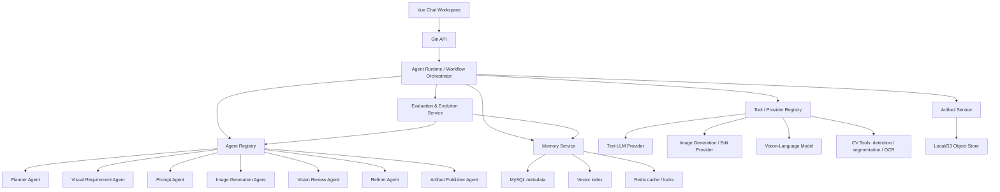

# 图片 AI Agent 平台开发调研与落地设计

生成日期：2026-05-25  
适用项目：`Yl_Agent_picture/gin_agent_gorm` + `frontend`  
调研重点：Agent 平台开发、多 Agent 协同、记忆管理、单 Agent 进化、图片相关 Agent 工程实现  

## 1. 结论先行

图片 Agent 平台不要只做成“用户输入 prompt -> 调用图片模型 -> 返回图片”的薄封装。更稳的形态是：

```text
会话入口
  -> Agent Runtime / Workflow Orchestrator
  -> 多 Agent 协作层
  -> 记忆检索与写入层
  -> 图片工具链 / 模型 Provider 层
  -> 产物与版本管理层
  -> 评测、反馈、进化层
```

结合 GitHub 上的主流项目，可以抽象出 5 条开发原则：

1. **编排优先于自由聊天**：图片任务通常有明确阶段，适合用 DAG、状态机或固定工作流编排。LangGraph、AutoGen、CrewAI、MetaGPT 都在不同层面证明了“可观测、可恢复、可分工”的价值。
2. **Agent 协作需要共享状态，不只需要多轮对话**：多 Agent 之间要通过 Run State、Task Ledger、Artifact Registry、Memory Store 共享事实，避免每个 Agent 靠自然语言猜测上下文。
3. **记忆要分层**：短期上下文、长期偏好、视觉风格、产物血缘、失败反思、用户反馈不应混在一张简单文本表里。
4. **图片 Agent 必须以产物为中心**：每张图、每次编辑、每个 mask、每个参考图分析结果都要有版本、来源、参数、模型、评价和可追溯记录。
5. **单 Agent 进化不是让模型“自己变聪明”，而是沉淀可复用的经验**：把成功 prompt、失败原因、用户偏好、工具参数、评测分数转成可检索记忆、规则、模板、技能和模型配置。

本项目目前已经有 `agent_runs`、`agent_steps`、`context_memories`、`artifacts`、Provider 抽象和图片产物存储，适合在现有结构上升级，而不是重写。

## 2. GitHub 项目阅读摘要

| 方向 | 代表项目 | 对本项目有用的工程模式 |
| --- | --- | --- |
| 状态化 Agent 编排 | LangGraph | 把 Agent Run 建模为可恢复的图；每个节点负责一个清晰步骤；状态持久化；支持人类介入与长任务。 |
| 多 Agent 对话与协作 | AutoGen | Agent 之间通过消息、工具调用、终止条件协作；适合做 Planner / Executor / Reviewer / UserProxy。 |
| 角色化任务团队 | CrewAI、MetaGPT、ChatDev | 用角色、目标、任务清单和 SOP 拆解复杂需求；适合图片任务中的需求分析、提示词、生成、审查、发布。 |
| Agent 社会与实验框架 | CAMEL、AgentScope | 支持大量 Agent、环境、消息路由、评测；适合后续做批量任务与实验平台。 |
| 记忆系统 | Letta、Mem0、LangMem、LlamaIndex | 把记忆当成独立基础设施：抽取、压缩、检索、更新、冲突处理、过期、权限隔离。 |
| 图片/视觉工具链 | ComfyUI、Diffusers、LLaVA、GroundingDINO、Segment Anything、ControlNet | 图片 Agent 需要调用多类视觉工具：生成、编辑、描述、分割、检测、重绘、质量评估、风格一致性。 |
| 单 Agent 进化 | Reflexion、Self-Refine、Voyager | 把失败轨迹转成反思，把成功路径转成技能；用自评、外部评测、用户反馈推动 prompt 和策略迭代。 |

## 3. 本项目现状对照

已有基础能力：

- `model.AgentRun`：记录一次用户消息触发的工作流，已有状态、意图、任务类型、文本模型、图片模型、优化 prompt 等字段。
- `model.AgentStep`：记录每个子步骤的输入、输出、状态、错误信息、思考/推理内容。
- `model.ContextMemory`：已有会话级记忆雏形，包括 `kind`、`content`、`score`。
- `model.Artifact`：保存图片、HTML 等产物元数据，已有 object key、preview URL、MIME、hash、size。
- `agent_svc.Provider`：已有 `Chat` 与 `Generate` 抽象，后续可以扩展为图片分析、编辑、分割、评测。
- 前端已经有对话、模型选择、智能优化、补充问答、右侧产物预览和步骤展示。

当前主要短板：

- Agent 编排仍偏固定流程，缺少清晰的 DAG/状态机定义、重试策略、节点输入输出契约。
- 记忆只有文本内容和分数，缺少命名空间、来源、向量索引、视觉记忆、过期策略、冲突解决。
- 图片产物只有单层 artifact，缺少版本链、参考图关系、编辑 mask、生成参数、评测结果。
- Provider 还没有区分生成、编辑、视觉理解、检测、分割、审查等工具能力。
- 单 Agent 进化还没有数据闭环：用户反馈、失败反思、prompt 版本、A/B 评测、技能库。

## 4. 推荐目标架构



建议把平台拆成 6 个稳定边界：

| 模块 | 职责 | 本项目落点 |
| --- | --- | --- |
| Agent Runtime | 创建 run、推进 step、持久化状态、重试、取消、恢复、SSE 事件 | 扩展 `internal/service/agent_svc` 或拆出 `agent_runtime` |
| Agent Registry | 注册 Planner、Prompt、Image、Review 等 Agent 定义 | 新增 `internal/service/agent_registry` |
| Memory Service | 抽取、检索、写入、过期、冲突处理、视觉记忆 | 新增 `internal/service/agent_memory` |
| Tool Registry | 统一管理文本模型、图片模型、VLM、CV 工具、对象存储工具 | 扩展 Provider 抽象 |
| Artifact Service | 图片/HTML/JSON 产物、版本、血缘、预览、下载、安全检查 | 扩展当前 `storage.go` 与 `artifacts` |
| Evolution Service | 记录反馈、评测、反思、prompt 版本、技能沉淀 | 新增 `agent_eval` / `agent_evolution` |

## 5. 多 Agent 协同工作需要什么

多 Agent 协同不是简单地“创建多个角色 prompt”。生产系统至少需要以下能力。

### 5.1 共享任务状态

每个 Agent 输入输出都应读写同一份 `RunState`：

```json
{
  "run_id": 123,
  "conversation_id": 15,
  "user_id": 1,
  "task_type": "image_generation",
  "intent": "generate_brand_poster",
  "user_request": "生成一张科技感宣传图",
  "constraints": {
    "aspect_ratio": "16:9",
    "style": "clean futuristic",
    "must_include": ["logo", "slogan"],
    "must_avoid": ["blurry text", "extra fingers"]
  },
  "memory_context": [],
  "artifacts": [],
  "budget": {
    "max_steps": 12,
    "max_image_generations": 3,
    "timeout_seconds": 180
  }
}
```

### 5.2 明确的 Agent 输入输出契约

不要让各 Agent 只返回自然语言。建议统一输出：

```json
{
  "status": "completed",
  "summary": "已生成图片提示词并选择 16:9 横图",
  "questions": [],
  "plan": [],
  "tool_calls": [],
  "artifacts": [],
  "memory_writes": [],
  "eval_scores": {},
  "next_step": "image_generation_agent"
}
```

### 5.3 任务账本 Task Ledger

每次 run 维护任务账本，用于避免遗漏和重复：

| 字段 | 说明 |
| --- | --- |
| `task_id` | 子任务 ID |
| `owner_agent` | 负责 Agent |
| `status` | pending/running/completed/failed/skipped |
| `depends_on` | 前置任务 |
| `input_refs` | 引用的消息、记忆、产物 |
| `output_refs` | 产出的 step、artifact、memory |
| `retry_count` | 重试次数 |

### 5.4 协同模式

| 模式 | 适用场景 | 示例 |
| --- | --- | --- |
| 顺序流水线 | 首版图片生成、HTML 产物生成 | Planner -> Prompt -> Image -> Review -> Artifact |
| Planner + Tools | 任务类型不确定，需要动态选择工具 | Planner 决定调用图片生成、图片编辑或文本回答 |
| Debate / Review | 高价值图片、品牌图、需要质量把关 | Generator 生成，Reviewer 挑错，Refiner 再改 |
| DAG 并行 | 多张候选图、多模型对比、批量尺寸输出 | 同时生成 3 张候选图，再统一审查 |
| Human-in-the-loop | 需求不清晰、版权/肖像/品牌风险高 | Agent 先追问或请求用户确认 |

### 5.5 生产级协作约束

- **幂等性**：每个 step 要有 `idempotency_key`，重试不应重复扣费或重复写产物。
- **资源锁**：同一个 run 同时只能有一个“主推进器”；同一 artifact 版本编辑需要锁。
- **预算控制**：限制最大 step 数、最大生成次数、最大 token、最大图片费用。
- **失败降级**：图片模型失败时可返回优化后的 prompt、失败原因和可重试选项。
- **可观测性**：每个 step 记录模型、参数、耗时、费用、输入摘要、输出摘要、错误。
- **安全边界**：不同用户、不同会话、不同 artifact 的权限必须由后端校验。

## 6. 建议 Agent 分工

| Agent | 职责 | 输入 | 输出 |
| --- | --- | --- | --- |
| Intent Router Agent | 判断文本聊天、图片生成、图片编辑、HTML 生成、历史查询 | 用户消息、附件 | `task_type`、下一步 |
| Requirement Agent | 抽取图片需求，判断是否追问 | 用户消息、历史、偏好 | 结构化需求、追问问题 |
| Memory Agent | 检索和写入相关记忆 | 用户、会话、任务类型 | 相关偏好、风格、历史产物 |
| Prompt Agent | 将需求转成模型可用 prompt | 结构化需求、记忆、模型限制 | 正向 prompt、负向 prompt、参数 |
| Image Generation Agent | 调用图片生成/编辑模型 | prompt、尺寸、参考图 | 图片 artifact |
| Vision Analysis Agent | 理解上传图或生成图 | 图片 artifact | caption、对象、文字、质量问题 |
| Review Agent | 审核图片是否符合需求 | 需求、图片分析、用户偏好 | 评分、问题、是否重试 |
| Refiner Agent | 根据审查结果生成二次修改策略 | 问题列表、原图、mask | 编辑 prompt、重试计划 |
| Artifact Agent | 保存、版本化、预览、下载 | 生成文件、元数据 | artifact 记录 |
| Evolution Agent | 从反馈和轨迹中沉淀经验 | run trace、评分、用户操作 | prompt 模板、记忆、规则、技能 |

首版不需要一次实现所有 Agent。推荐 MVP 流程：

```text
Intent Router
  -> Requirement Agent
  -> Memory Agent
  -> Prompt Agent
  -> Image Generation Agent
  -> Artifact Agent
```

第二阶段再加：

```text
Vision Analysis Agent
  -> Review Agent
  -> Refiner Agent
  -> Evolution Agent
```

## 7. 记忆管理设计

### 7.1 记忆分层

| 记忆类型 | 示例 | 存储建议 | 检索方式 |
| --- | --- | --- | --- |
| 短期上下文 | 最近 20 条对话、当前 run state | MySQL + Redis | conversation_id |
| 会话摘要 | 本会话目标、已确认需求 | MySQL | conversation_id |
| 用户偏好 | 喜欢冷色科技风、默认 16:9 | MySQL + vector | user_id + semantic |
| 视觉风格记忆 | 品牌色、构图偏好、参考图描述 | MySQL + vector + artifact refs | semantic + tag |
| 产物记忆 | 哪张图由什么 prompt、模型、参数生成 | MySQL artifact lineage | artifact_id/run_id |
| 工具经验 | 某模型中文文字容易糊、某尺寸效果好 | MySQL/vector | model_name + task_type |
| 失败反思 | 上次 logo 文本错位，需单独渲染文字 | MySQL/vector | failure_type + semantic |
| 评测记忆 | 用户选择了第 2 张图，评分 4.5 | MySQL | user_id + task_type |

### 7.2 建议扩展 `context_memories`

当前 `context_memories` 只有 `conversation_id`、`user_id`、`kind`、`content`、`score`。建议升级为：

```sql
ALTER TABLE context_memories
  ADD COLUMN namespace VARCHAR(64) NOT NULL DEFAULT 'conversation',
  ADD COLUMN source_type VARCHAR(64) NOT NULL DEFAULT '',
  ADD COLUMN source_id BIGINT UNSIGNED NOT NULL DEFAULT 0,
  ADD COLUMN artifact_id BIGINT UNSIGNED NOT NULL DEFAULT 0,
  ADD COLUMN tags JSON NULL,
  ADD COLUMN confidence DECIMAL(5,4) NOT NULL DEFAULT 0.8000,
  ADD COLUMN embedding_id VARCHAR(128) NOT NULL DEFAULT '',
  ADD COLUMN expires_at BIGINT NOT NULL DEFAULT 0,
  ADD COLUMN last_used_at BIGINT NOT NULL DEFAULT 0,
  ADD COLUMN use_count INT NOT NULL DEFAULT 0;
```

`namespace` 建议取值：

- `conversation`：只在当前会话使用。
- `user_profile`：跨会话用户偏好。
- `visual_style`：图片风格、品牌、构图偏好。
- `artifact_lineage`：产物血缘与版本关系。
- `tool_experience`：工具/模型调用经验。
- `reflection`：失败反思和改进建议。

### 7.3 记忆写入策略

不要每轮都无脑写长期记忆。建议只写入满足以下条件之一的内容：

- 用户明确表达稳定偏好：例如“以后都用 16:9 横图”。
- 用户选择、收藏、下载、复用某个产物。
- Review Agent 发现可复用的失败模式。
- 同一类需求重复出现 2 次以上。
- 高分结果可沉淀为 prompt 模板或风格模板。

写入前要经过 `Memory Agent` 结构化：

```json
{
  "namespace": "visual_style",
  "kind": "user_preference",
  "content": "用户偏好冷色科技风、干净背景、少量蓝绿色发光元素。",
  "tags": ["style", "technology", "poster"],
  "confidence": 0.86,
  "source_type": "user_feedback",
  "source_id": 991
}
```

### 7.4 记忆检索策略

图片任务建议组合 4 类检索：

1. **会话内精确检索**：最近消息、当前补充问答、当前 artifact。
2. **用户偏好检索**：跨会话稳定偏好。
3. **视觉风格语义检索**：相似风格、相似用途、相似参考图。
4. **失败经验检索**：同一模型、同一任务类型下的历史坑点。

排序建议：

```text
final_score =
  semantic_score * 0.45
  + recency_score * 0.20
  + user_feedback_score * 0.20
  + confidence * 0.10
  + artifact_reuse_score * 0.05
```

### 7.5 记忆冲突处理

例如用户早期说“喜欢暗色风格”，后来又说“这个项目以后要明亮简洁”。处理规则：

- 新记忆不要直接覆盖旧记忆，要先记录 `scope`。
- 如果 scope 不同，可以共存：个人偏好 vs 某项目偏好。
- 如果 scope 相同且冲突，降低旧记忆 confidence，提升新记忆 confidence。
- Prompt Agent 只使用当前任务 scope 下最高置信度的记忆。

## 8. 图片 Agent 工作流设计

### 8.1 文生图工作流

```text
1. 用户输入需求
2. Intent Router 判断 task_type=image_generation
3. Requirement Agent 抽取结构化需求
4. 信息不足则生成最多 3 个追问
5. Memory Agent 检索用户偏好、历史风格、失败经验
6. Prompt Agent 生成正向 prompt、负向 prompt、尺寸、风格参数
7. Image Generation Agent 调用图片模型
8. Artifact Agent 保存图片和生成参数
9. Vision Analysis Agent 分析生成结果
10. Review Agent 打分
11. 如果低于阈值且预算允许，Refiner Agent 自动再生成或编辑
12. 返回最佳结果，写入记忆和评测数据
```

### 8.2 图生图 / 图片编辑工作流

```text
1. 用户上传参考图或待编辑图
2. Artifact Agent 保存原图
3. Vision Analysis Agent 生成图片描述、对象列表、OCR、构图信息
4. Requirement Agent 抽取编辑目标
5. 如需局部编辑，Segmentation Tool 生成 mask
6. Prompt Agent 生成编辑 prompt
7. Image Edit Agent 调用编辑模型
8. Review Agent 对比原图与目标
9. Artifact Agent 保存新版本并建立 parent_artifact_id
```

### 8.3 品牌图 / 海报图工作流

这类图片要求更高，建议开启 Review + Refine：

```text
Requirement Agent:
  - 识别用途：品牌海报、商品图、社媒图、封面图
  - 抽取约束：尺寸、logo、文字、色彩、主体、禁用元素

Prompt Agent:
  - 生成图片 prompt
  - 将文字元素单独结构化，避免图片模型直接生成复杂中文小字

Image Agent:
  - 生成无文字或少文字底图

HTML/Canvas Agent:
  - 对 logo、标题、卖点文字做可控排版

Review Agent:
  - 检查文字可读性、主体完整性、品牌一致性
```

对中文海报，推荐路线是“图片模型生成视觉底图 + 前端/后端可控排版文字”，不要把所有中文文字都交给图片模型硬生成。

### 8.4 候选图并行工作流

```text
Prompt Agent 输出 3 个候选 prompt
  -> Image Agent 并行生成 3 张图
  -> Vision Review Agent 逐张分析
  -> Ranker Agent 排序
  -> 返回最佳图 + 备选图
```

需要新增：

- `artifact_group_id`：同一轮候选图分组。
- `rank_score`：候选排序分。
- `selected_by_user`：用户是否选择。

## 9. 产物与版本管理

图片 Agent 的核心资产是 artifact。建议新增版本表：

```sql
CREATE TABLE artifact_versions (
  id BIGINT UNSIGNED PRIMARY KEY AUTO_INCREMENT,
  artifact_id BIGINT UNSIGNED NOT NULL,
  parent_version_id BIGINT UNSIGNED NOT NULL DEFAULT 0,
  agent_run_id BIGINT UNSIGNED NOT NULL,
  version_no INT NOT NULL,
  operation VARCHAR(64) NOT NULL,
  prompt TEXT,
  negative_prompt TEXT,
  model_provider VARCHAR(128) NOT NULL DEFAULT '',
  model_name VARCHAR(128) NOT NULL DEFAULT '',
  generation_params JSON NULL,
  source_refs JSON NULL,
  quality_scores JSON NULL,
  object_key VARCHAR(512) NOT NULL,
  preview_url VARCHAR(512) NOT NULL DEFAULT '',
  hash VARCHAR(128) NOT NULL DEFAULT '',
  created_at BIGINT NOT NULL,
  updated_at BIGINT NOT NULL
);
```

建议每个 artifact 记录：

- 原始用户需求。
- 结构化需求。
- 最终 prompt。
- negative prompt。
- 模型 provider 和模型名。
- 尺寸、seed、steps、CFG、采样器等参数，按 provider 能力保存。
- 参考图、mask、父版本。
- Review Agent 评分。
- 用户反馈：下载、收藏、选择、重试、差评原因。

这样才能支持：

- 回滚到旧版本。
- 基于某张图继续编辑。
- 分析哪个模型/参数最有效。
- 把成功产物沉淀为模板或记忆。

## 10. Tool / Provider 抽象升级

当前接口：

```go
type Provider interface {
    Chat(request ChatRequest) (ChatResult, error)
    Generate(request GenerationRequest) ([]GeneratedFile, error)
}
```

建议拆分能力，而不是所有 provider 都实现全部方法：

```go
type TextProvider interface {
    Chat(ctx context.Context, request ChatRequest) (ChatResult, error)
}

type ImageGenerationProvider interface {
    GenerateImage(ctx context.Context, request ImageGenerationRequest) ([]GeneratedFile, error)
}

type ImageEditProvider interface {
    EditImage(ctx context.Context, request ImageEditRequest) ([]GeneratedFile, error)
}

type VisionProvider interface {
    AnalyzeImage(ctx context.Context, request ImageAnalysisRequest) (ImageAnalysisResult, error)
}

type SegmentationProvider interface {
    Segment(ctx context.Context, request SegmentationRequest) (MaskResult, error)
}
```

工具注册建议：

```json
{
  "name": "jimeng_image_generation",
  "kind": "image_generation",
  "provider": "volcengine",
  "model": "jimeng",
  "capabilities": ["text_to_image"],
  "limits": {
    "max_prompt_chars": 750,
    "supported_ratios": ["1:1", "16:9", "9:16"]
  }
}
```

### 10.1 图片工具链建议

| 能力 | 候选工具/项目 | 用途 |
| --- | --- | --- |
| 文生图/图生图 | OpenAI Images、即梦、通义万相、Stable Diffusion、Diffusers | 生成主图 |
| 节点化生成工作流 | ComfyUI | 复杂图像管线、ControlNet、LoRA、批处理 |
| 视觉理解 | LLaVA、OpenAI Vision、Qwen-VL 等 | 生成图审查、参考图理解 |
| 目标检测 | GroundingDINO | 按文本找图中对象 |
| 分割/mask | Segment Anything | 局部编辑、主体提取 |
| 可控生成 | ControlNet | 姿态、边缘、深度、线稿控制 |
| OCR | PaddleOCR、云 OCR | 海报文字检查 |

建议第一阶段优先接入：

1. 已有图片生成 provider。
2. 一个 VLM 图片分析 provider。
3. 一个 OCR/文字检查工具。
4. 后续再接入 GroundingDINO + SAM 做局部编辑。

## 11. 单 Agent 进化设计

单 Agent 进化应实现为数据闭环，不应依赖模型“自我感觉良好”。

### 11.1 进化数据来源

| 数据 | 来源 | 用途 |
| --- | --- | --- |
| Run trace | `agent_runs` + `agent_steps` | 复盘每次执行路径 |
| Prompt version | Prompt Agent 输出 | 找出高成功率模板 |
| Artifact quality | Review Agent / 用户反馈 | 排序模型、参数、prompt |
| User action | 下载、收藏、选择、重试 | 隐式偏好 |
| Failure reason | 错误、低分、用户差评 | 形成失败反思 |
| Cost/latency | provider 调用日志 | 优化路由和预算 |

### 11.2 进化循环

```text
Collect:
  收集 run trace、artifact、用户反馈、模型参数

Reflect:
  Evolution Agent 总结成功/失败原因

Distill:
  生成记忆、prompt 模板、工具参数建议、规则

Evaluate:
  用固定测试集或历史任务回放验证

Promote:
  通过 A/B 或人工审核后升级默认策略
```

### 11.3 建议新增表

```sql
CREATE TABLE agent_prompt_versions (
  id BIGINT UNSIGNED PRIMARY KEY AUTO_INCREMENT,
  agent_name VARCHAR(128) NOT NULL,
  version VARCHAR(64) NOT NULL,
  prompt_template TEXT NOT NULL,
  changelog TEXT,
  status VARCHAR(32) NOT NULL DEFAULT 'draft',
  metrics JSON NULL,
  created_at BIGINT NOT NULL,
  updated_at BIGINT NOT NULL
);

CREATE TABLE agent_reflections (
  id BIGINT UNSIGNED PRIMARY KEY AUTO_INCREMENT,
  agent_run_id BIGINT UNSIGNED NOT NULL,
  agent_name VARCHAR(128) NOT NULL,
  failure_type VARCHAR(128) NOT NULL DEFAULT '',
  reflection TEXT NOT NULL,
  action_item TEXT NOT NULL,
  promoted_to_memory TINYINT(1) NOT NULL DEFAULT 0,
  created_at BIGINT NOT NULL,
  updated_at BIGINT NOT NULL
);

CREATE TABLE artifact_feedback (
  id BIGINT UNSIGNED PRIMARY KEY AUTO_INCREMENT,
  artifact_id BIGINT UNSIGNED NOT NULL,
  user_id BIGINT UNSIGNED NOT NULL,
  feedback_type VARCHAR(64) NOT NULL,
  rating INT NOT NULL DEFAULT 0,
  comment TEXT,
  created_at BIGINT NOT NULL
);
```

### 11.4 反思样例

```json
{
  "agent_name": "prompt_agent",
  "failure_type": "text_rendering",
  "reflection": "用户要求中文标题清晰，但图片模型生成的中文不可读。",
  "action_item": "海报类任务默认生成无文字底图，再由 HTML/Canvas 层渲染文字。",
  "memory_namespace": "tool_experience",
  "tags": ["poster", "chinese_text", "image_generation"]
}
```

### 11.5 进化的安全门槛

- 自动生成的反思默认只进入 `draft`，不直接改变生产 prompt。
- 只有高频出现或人工确认的反思才能提升为规则。
- 每次 prompt 模板升级必须保留旧版本和回滚路径。
- 关键指标：成功率、用户重试率、平均生成次数、下载率、平均耗时、成本。

## 12. 前后端 API 建议

### 12.1 消息提交

现有接口可以扩展，不必立即新增入口：

```http
POST /api/conversations/:id/messages
```

请求建议：

```json
{
  "input_type": "normal",
  "task_type": "image_generation",
  "content": "生成一张科技感新品发布会海报",
  "workflow_mode": "auto",
  "attachments": [
    {
      "artifact_id": 88,
      "role": "reference_image"
    }
  ],
  "model_config": {
    "text_model_config_id": 1,
    "image_model_config_id": 2,
    "vision_model_config_id": 3
  },
  "generation_options": {
    "aspect_ratio": "16:9",
    "candidate_count": 3,
    "auto_review": true,
    "auto_refine": true
  }
}
```

### 12.2 Run 事件

继续使用：

```http
GET /api/runs/:id/events
```

事件建议：

```json
{
  "event": "agent_step_completed",
  "run_id": 21,
  "step": {
    "name": "vision_review_agent",
    "status": "completed",
    "summary": "图片主体清晰，但标题区域不适合直接放文字。",
    "duration_ms": 1832
  }
}
```

### 12.3 产物操作

```http
GET  /api/conversations/:id/artifacts
GET  /api/artifacts/:id/download
POST /api/artifacts/:id/feedback
POST /api/artifacts/:id/edit
GET  /api/artifacts/:id/versions
POST /api/artifacts/:id/select
```

### 12.4 记忆操作

管理端或调试端建议提供：

```http
GET    /api/memories?namespace=visual_style
POST   /api/memories/search
PATCH  /api/memories/:id
DELETE /api/memories/:id
```

普通用户不一定直接看到“记忆管理”，但需要能删除偏好和历史。

## 13. 数据库演进路线

### Phase 1：补齐图片产物血缘

- 新增 `artifact_versions`。
- 给 `artifacts` 增加 `parent_artifact_id`、`artifact_group_id`、`rank_score`、`selected_at`。
- `agent_steps` 增加 `duration_ms`、`cost_json`、`model_name`、`provider_name`、`input_hash`、`output_hash`。

### Phase 2：升级记忆

- 扩展 `context_memories`。
- 增加向量索引接入层，可先使用外部向量库，也可以先只做 MySQL 文本检索。
- 增加 `memory_events` 记录记忆创建、更新、使用、降权、删除。

### Phase 3：评测和进化

- 新增 `artifact_feedback`。
- 新增 `agent_prompt_versions`。
- 新增 `agent_reflections`。
- 新增 `eval_runs`、`eval_cases`，支持历史任务回放。

## 14. 后端代码组织建议

可以保持当前 `agent_svc` 不大动，但内部按文件拆清楚：

```text
internal/service/agent_svc/
  service.go
  runtime.go
  workflow.go
  workflow_state.go
  agent_registry.go
  agents/
    planner_agent.go
    requirement_agent.go
    memory_agent.go
    prompt_agent.go
    image_agent.go
    vision_review_agent.go
    refiner_agent.go
    artifact_agent.go
    evolution_agent.go
  memory/
    memory_service.go
    memory_retriever.go
    memory_writer.go
    memory_ranker.go
  tools/
    registry.go
    text_provider.go
    image_provider.go
    vision_provider.go
    segmentation_provider.go
  artifacts/
    artifact_service.go
    version_service.go
    feedback_service.go
  eval/
    evaluator.go
    reflection_service.go
```

如果后续代码继续变大，再拆成独立 package。

## 15. 图片 Agent Prompt 策略

### 15.1 结构化需求

Prompt Agent 不应直接把用户原文丢给图片模型。推荐中间结构：

```json
{
  "subject": "科技新品发布会主视觉",
  "scene": "未来感展台，深色背景，蓝绿色光效",
  "style": "clean futuristic commercial poster",
  "composition": "center hero object, large empty area at top for title",
  "lighting": "soft rim light, controlled glow",
  "color_palette": ["black", "cyan", "electric blue"],
  "aspect_ratio": "16:9",
  "text_policy": "no embedded Chinese text in image",
  "must_include": ["abstract product silhouette"],
  "must_avoid": ["blurry text", "extra limbs", "watermark", "busy background"]
}
```

### 15.2 Prompt 输出

```json
{
  "positive_prompt": "A clean futuristic commercial poster background for a technology product launch, central abstract product silhouette, dark premium stage, cyan and electric blue rim lights, spacious top area reserved for readable title overlay, high-end advertising photography, sharp details, balanced composition",
  "negative_prompt": "blurry text, unreadable letters, watermark, logo artifacts, cluttered background, low resolution, distorted shapes",
  "render_text_separately": true,
  "layout_hints": {
    "title_area": "top 25%",
    "safe_margin": "8%"
  }
}
```

### 15.3 图片文字处理原则

- 中文海报：图片模型生成底图，HTML/Canvas/SVG 层负责中文标题和卖点文字。
- 英文短词：可尝试图片模型直接生成，但必须 OCR 检查。
- Logo：优先作为独立素材叠加，不建议让图片模型“想象 logo”。
- 多语言文本：必须进入可控排版层。

## 16. 前端体验建议

图片 Agent 工作台建议围绕“对话 + 产物 + 过程 + 版本”组织：

| 区域 | 功能 |
| --- | --- |
| 左侧会话 | 历史会话、任务类型、收藏产物 |
| 中间对话 | 用户输入、补充问答、智能优化、模型选择 |
| 右侧产物 | 当前图片、候选图、版本切换、下载、继续编辑 |
| 过程面板 | Agent step、模型调用、评测结果、错误重试 |
| 反馈入口 | 选择最佳、评分、差评原因、重新生成、局部编辑 |

建议新增前端状态：

```ts
type ArtifactVersion = {
  id: number
  artifactId: number
  versionNo: number
  operation: string
  previewUrl: string
  qualityScores?: Record<string, number>
  selectedByUser?: boolean
}
```

用户反馈按钮不要复杂，首版只要：

- 选择这张。
- 重新生成。
- 局部修改。
- 不满意原因。
- 下载。

这些行为都应写入后端，作为进化数据。

## 17. 安全、权限与合规

图片 Agent 比纯文本 Agent 更容易碰到风险：

- 上传图可能包含人脸、证件、隐私信息。
- 生成图可能涉及版权角色、品牌、商标。
- 图像编辑可能涉及伪造、误导性内容。
- 产物文件可能被越权访问。

建议：

1. Artifact 下载和预览必须校验 `user_id` 和 `conversation_id`。
2. 上传文件限制 MIME、大小、像素、扩展名，重新编码去除危险内容。
3. 对象存储 key 不应可预测，至少包含随机 ID 或 hash。
4. 对 public preview 增加签名 URL 或鉴权代理。
5. 生成前后都可接入安全审查工具。
6. 日志中不要保存完整敏感图片 URL、API key 或用户隐私。
7. 原始模型推理内容不要直接暴露给用户；展示应使用整理后的 step summary。

## 18. 推荐实施计划

### 第 0 周：整理基线

- 梳理当前 `agent_runs`、`agent_steps`、`artifacts`、`context_memories` 使用情况。
- 为每个 step 增加耗时、provider、model、错误类型。
- 固定事件格式，让前端过程面板稳定消费。

验收：

- 一次图片生成能看到完整 step timeline。
- 每个 artifact 能追溯到 run、step、prompt、模型。

### 第 1 周：图片产物版本化

- 新增 `artifact_versions`。
- 支持候选图分组和用户选择。
- 保存生成参数和 quality score。

验收：

- 同一任务生成 3 张候选图，前端可切换。
- 用户选择第 2 张后，后端记录 feedback 和 selected 状态。

### 第 2 周：记忆服务 MVP

- 扩展 `context_memories`。
- 实现 Memory Retriever 和 Memory Writer。
- 首先支持用户偏好、视觉风格、失败反思 3 类记忆。

验收：

- 用户说“以后默认 16:9 科技蓝风格”，下一次图片任务自动带入。
- 用户可删除或覆盖偏好。

### 第 3 周：Vision Review

- 接入一个 VLM 或 OCR 能力。
- 对生成图做 caption、OCR、质量检查。
- 低分时生成可解释问题。

验收：

- 海报图中文字不可读时能被检测出来。
- Review 结果写入 artifact version。

### 第 4 周：自动 Refine

- 根据 Review Agent 的问题自动生成二次 prompt。
- 限制最多重试 1-2 次。
- 比较原图和改进图。

验收：

- 常见问题如构图太满、文字区域不足、主体不清晰可自动重试。

### 第 5 周：进化闭环

- 新增 artifact feedback。
- 新增 agent reflections。
- 新增 prompt version。
- 每周从高分和低分任务中生成候选规则，人工确认后启用。

验收：

- 能列出“本周图片生成失败 Top 5 原因”。
- 能回滚 Prompt Agent 模板版本。

## 19. MVP 技术决策

推荐首版采用：

- 编排：后端固定 DAG + 数据库状态，不急着引入外部工作流引擎。
- 队列：继续使用 Redis/Asynq 承接长任务，HTTP 只负责创建 run 和 SSE 查询。
- 记忆：MySQL 结构化记忆 + 简单关键词检索，后续接向量库。
- 图片生成：复用现有 provider，补齐模型能力描述和参数记录。
- 图片审查：优先接 VLM/OCR，暂不做复杂检测/分割。
- 进化：先记录反馈和反思，不自动改生产 prompt。

这条路线风险最小，因为它复用现有工程骨架，同时为 LangGraph/AutoGen/CrewAI 那类复杂编排思想保留了扩展点。

## 20. 参考来源

以下来源用于归纳本文设计，均为 2026-05-25 调研时可访问的 GitHub 或官方文档：

- LangGraph: https://github.com/langchain-ai/langgraph
- OpenAI Agents SDK: https://github.com/openai/openai-agents-python
- AutoGen: https://github.com/microsoft/autogen
- CrewAI: https://github.com/crewAIInc/crewAI
- CAMEL: https://github.com/camel-ai/camel
- MetaGPT: https://github.com/FoundationAgents/MetaGPT
- ChatDev: https://github.com/OpenBMB/ChatDev
- AgentScope: https://github.com/modelscope/agentscope
- Letta: https://github.com/letta-ai/letta
- Mem0: https://github.com/mem0ai/mem0
- LangMem: https://github.com/langchain-ai/langmem
- LlamaIndex: https://github.com/run-llama/llama_index
- ComfyUI: https://github.com/comfyanonymous/ComfyUI
- Hugging Face Diffusers: https://github.com/huggingface/diffusers
- LLaVA: https://github.com/haotian-liu/LLaVA
- GroundingDINO: https://github.com/IDEA-Research/GroundingDINO
- Segment Anything: https://github.com/facebookresearch/segment-anything
- ControlNet: https://github.com/lllyasviel/ControlNet
- Visual ChatGPT / TaskMatrix: https://github.com/microsoft/TaskMatrix
- Reflexion: https://github.com/noahshinn/reflexion
- Self-Refine: https://github.com/madaan/self-refine
- Voyager: https://github.com/MineDojo/Voyager
- OpenAI Image Generation 官方文档: https://platform.openai.com/docs/guides/image-generation

